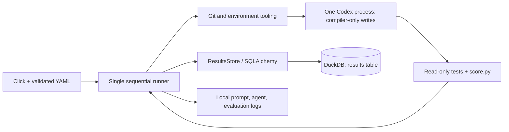

# Compiler autoresearch

One synchronous Python runner, one Codex agent at a time, one local DuckDB file.

```text
autoresearch/
├── __main__.py          python -m autoresearch
├── cli.py               Click options and startup errors
├── config.py            frozen Pydantic dataclass; YAML hydration/validation
├── defaults.yaml        single source of default settings
├── runner.py            baseline → propose → validate → commit → evaluate → record
├── database.py          SQLAlchemy Result schema + ResultsStore read/write interface
├── environment.py       Git worktrees, subprocesses, permissions, artifact checks
├── agent_instructions.md rules injected from the runner's checkout
└── agent_prompt.md       task template + recent results + current best score
```

## Run and configure

Python 3.10+, Git, and a current authenticated Codex CLI are required on macOS/Linux.
The permission-profile flags were checked against Codex 0.157.0.

```sh
python3 -m venv .venv
make install  # editable package + development tools from pyproject.toml
# Install Codex if needed; then authenticate with codex login.
.venv/bin/python -m autoresearch --show-config
.venv/bin/python -m autoresearch --config experiment.yaml --iterations 3
.venv/bin/python -m autoresearch --iterations 0  # baseline only; still needs Codex sandbox
```

A user YAML can contain only `iterations: 3`; omitted fields inherit
[defaults.yaml](defaults.yaml). Precedence: defaults < user YAML < explicit CLI
options. Unknown keys and invalid values fail before execution. `--show-config`
prints complete reusable YAML without opening Git, a database, or Codex.
Relative `db` paths start at the repository root; `--config` is relative to the
calling directory. Logs are beside the selected database.

`make format` runs Ruff formatting and fixes at line length 150; `make check`
checks without edits. Ruff and Black exclude the original compiler, evaluator,
and public tests in `pyproject.toml`. Cursor's formatter settings and rulers also
use 150. Installed YAML/Markdown package resources preserve CLI defaults and
agent instructions outside the source checkout. The `autoresearch` console
command is equivalent to `python -m autoresearch`.

## System and concurrency



Each invocation has a unique `run_id`; iteration 0 evaluates the starting commit.
Each changed proposal is **exactly one runner-created commit**, not a commit chain.
No-change attempts and failures before committing have no proposal commit.
Failed evaluations and slower proposals retain their commits for inspection.
Only a passing, strictly better score becomes the next attempt's parent; ties
are rejected. Scores use the benchmark's printed precision. Proposals carry an
authorship footer recording the configured model and effort. Nothing is merged or pushed.

Default storage: `.autoresearch/results.duckdb` and `.autoresearch/logs/<run>/<iteration>/`.
The `results` table records lineage, status, metrics, elapsed time, and paths;
[Result's docstring](database.py) defines every field. `logs` is a directory path,
not embedded log content. `start_attempt()` and `finish_attempt()` commit
separately; no transaction stays open during an experiment. Abrupt termination
can leave `running` rows; there is no automatic recovery or job claiming.

**One runner writes a given DB at a time.** This implementation has no worker
threads, remote DB service, shared job queue, or cross-machine coordination.
SQLAlchemy uses `duckdb-engine`; it does not change DuckDB's concurrency rules.
The original schema remains compatible; `create_all()` creates missing tables,
not migrations. [DuckDB concurrency](https://duckdb.org/docs/current/connect/concurrency),
[SQLAlchemy schema lifecycle](https://docs.sqlalchemy.org/en/20/core/metadata.html#creating-and-dropping-database-tables).

Resume from a retained branch with `--base autoresearch/<run-id>/<iteration>`.

## What each agent sees

```text
trusted host runner                     temporary worktree at current best commit
├── user's checkout (not edited)         ├── compiler.py              READ + WRITE
├── shared Git refs/objects              ├── README.md, machine.py    READ
├── results.duckdb                       ├── score.py, programs/      READ
└── logs/<run>/<iteration>/              ├── tests/, other tracked files READ
    ├── prompt.txt                      └── .git → shared metadata   READ
    ├── codex.log
    ├── tests.log
    └── score.log
```

The baseline uses a detached worktree and no agent. Each proposal uses a fresh
worktree/branch; the checkout is removed on success, error, or Ctrl-C. Branches
and logs remain. Rules and task text come from the runner package even when the
starting commit predates it. [Git worktrees share repository metadata](https://git-scm.com/docs/git-worktree).

- **Local tools:** Codex shell/file editing and installed commands, including
  Python and Git. No Python Codex SDK or runner DB tool is exposed to the agent.
- **Writes:** the requested Codex profile extends `:read-only` and grants only
  that worktree's `compiler.py` write access. Other files, temp files, Git metadata,
  and runner logs/DB are not writable by sandboxed commands. Use Python `-B`.
- **Network/tools:** command networking and approval escalation are disabled.
  Web search, subagents, apps, plugins, browser, computer use, and image generation
  are explicitly disabled. System/project MCP configuration has separate controls;
  it must be trusted or restricted with managed policy.
- **Reads:** broad local reads remain allowed, subject to OS/managed restrictions.
  This is not a container, secret-hiding boundary, or guarantee against malicious
  compiler behavior. Codex model/authentication traffic is outside command networking.
- **Acceptance:** reject changed HEAD/branch, staged/unstaged edits outside
  `compiler.py`, extra files (including ignored files), and missing/symlinked
  compiler artifacts. Evaluate under Codex's read-only sandbox, then check again.
  These checks enforce scope; they do not prove code harmless or scores honest.

The host runner owns Git/DB/log writes and trusts the starting repository and
installed tools. `--ignore-user-config`, `--ignore-rules`, `--strict-config`, and
`--no-daemon` make CLI invocation explicit; managed restrictions still apply.
System/project configuration must not select legacy sandbox settings, which
can override profiles. Process-group timeouts stop ordinary child processes;
this is not a VM or a hostile-process containment system.

Sources: [permission profiles and enforcement](https://learn.chatgpt.com/docs/permissions),
[CLI flags](https://learn.chatgpt.com/docs/developer-commands),
[non-interactive execution](https://learn.chatgpt.com/docs/non-interactive-mode).

## Tests

```sh
.venv/bin/python -B -m unittest discover -s tests/autoresearch -t . -v
.venv/bin/python -B -m unittest -v tests.test_machine tests.test_public_programs
.venv/bin/python -B score.py
```

`make test` runs both test suites; `make test-sandbox` enables the OS probes.

[tests/autoresearch/README.md](../tests/autoresearch/README.md) lists real versus
mocked boundaries and the opt-in OS sandbox probes. Compiler evaluation selects
only the two original test modules above plus `score.py`, never infrastructure tests.
