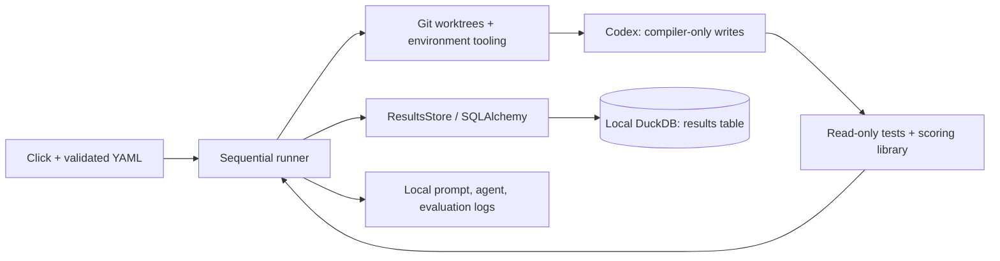

# Compiler autoresearch

Sequential compiler search: propose a change to the best verified commit;
keep it only if evaluation shows improvement.

## System and concurrency

### Computational model

One host runs the coordinator, Codex CLI/SDK, worktrees, evaluation, DuckDB, and
logs; model inference is remote. Attempts are sequential: no parallel agent pool,
distributed scheduler, or remote DB service.



### Invariants

- **Identity:** one invocation creates one `run_id`; `(run_id, iteration)` identifies
  a result. Iteration 0 is the baseline and starts no agent.
- **Concurrency:** at most one agent attempt is scheduled. One writer per DB is an
  operating requirement; separate invocations are not coordinated by a runner lock.
- **Ownership:** the agent may edit only `compiler.py`; the runner requests one
  proposal commit per changed attempt and owns Git/DB/log writes. Host Git tools/configuration are trusted.
- **Selection:** only a strictly better score after successful evaluation, scope
  validation, and cleanup changes the best parent. Ties and failures retain it.
- **Persistence:** `running` and final results commit separately; no DB transaction
  spans an experiment. Committed rejected/failed proposals remain; nothing is merged or pushed.

Storage defaults to `.autoresearch/results.duckdb` and `logs/<run>/<iteration>/`
beside it. [Result](database.py) defines every column; `logs` is a directory path.
Abrupt termination can leave `running` rows; recovery/job claiming is not implemented.
SQLAlchemy preserves [DuckDB's concurrency rules](https://duckdb.org/docs/current/connect/concurrency);
[`create_all()`](https://docs.sqlalchemy.org/en/20/core/metadata.html#creating-and-dropping-database-tables)
creates missing tables, not schema migrations.

## Autoresearch algorithm

[runner.py](runner.py) implements greedy search.

| Decision | Current behavior |
| --- | --- |
| Run/budget | Resolve `base` (default `main`), evaluate baseline, then allow `iterations` attempts (default 10). Failures/no-change consume an attempt. |
| Model/effort | Fixed by configuration: defaults `gpt-6-astra` / `xhigh`; no adaptive selection. Recorded in results and proposal commit footers. |
| Proposal | Fresh Codex process, best commit's worktree, packaged instructions, best score, and last five result summaries from this run. The agent chooses the optimization; conversations/rejected changes are not resumed. |
| Objective | Pass public correctness tests, then maximize `sqrt(cycle_speedup * scratch_reduction)`; both factors are geometric means over public programs. Compare full-precision values; never accept ties or worse candidates. |
| Stop/continue | Low quota stops; quota-read errors or baseline failure abort. Agent/evaluation errors and timeouts are recorded, then continue. Ctrl-C records interruption and exits. |
| Start from prior work | `--base autoresearch/<run-id>/<iteration>` starts a new run/baseline from that branch, with a fresh budget and prompt history. |

Evaluation calls the runner's `score.score()` in the read-only sandbox against
the worktree's compiler, machine, and programs; older commits need not contain the API.
The dictionary returns via JSON, never log parsing. `python score.py` retains its report.

### Loop (pseudocode)

```text
config = hydrate(defaults < YAML < CLI)
run_id = new_id()
best = baseline(resolve(config.base))  # evaluate, clean up, record iteration 0; abort on failure
for iteration in 1..config.iterations:
    if quota_below_reserve(): break    # read errors abort; no attempt row/branch yet
    record_running(run_id, iteration, parent=best.commit)
    status, commit, metrics, error = failed, none, empty, none
    try:
        with fresh_worktree(best.commit):
            agent(config.model, config.effort, best, last_5_results(run_id))
            if validate_proposal() == unchanged:
                status = no_change; continue
            commit = commit_compiler()  # retained even if evaluation fails
            metrics = correctness_tests_then_score()
            validate_worktree_unchanged()
        # Cleanup succeeded before selection.
        if metrics.combined_score > best.score:
            best, status = (commit, metrics.combined_score), improved
        else: status = rejected
    except interruption: status, error = interrupted, interruption; abort
    except failure: status = timeout if timed_out else failed; error = failure
    finally: record_final(status, commit, metrics, elapsed_time, error)
report(best)
```

## Run and configure

Requires Python 3.10+, Git, and an authenticated Codex CLI on macOS/Linux.
Permission-profile flags were checked against Codex 0.157.0.

```sh
make install  # creates .venv; installs package + development tools
codex login
.venv/bin/python -m autoresearch --show-config
.venv/bin/python -m autoresearch --config experiment.yaml --iterations 3
.venv/bin/python -m autoresearch --iterations 0  # baseline only; still uses Codex sandbox
```

Precedence: [defaults.yaml](defaults.yaml) < partial user YAML < explicit CLI options.
Invalid fields fail before execution. `--show-config` prints hydrated
YAML without opening Git, DB, or Codex. `db` is repository-relative; `--config`
is relative to the calling directory. Defaults allow 900 seconds per agent command
and 180 per evaluation command, not a total run deadline. The installed `autoresearch`
command aliases `python -m autoresearch`; defaults/instructions ship with the package.

### Usage limits

Before each agent attempt, [usage.py](usage.py) reads fresh quotas through the
[Python SDK](https://learn.chatgpt.com/docs/codex-sdk#python-library)'s
[`account/rateLimits/read`](https://learn.chatgpt.com/docs/app-server#6-rate-limits-chatgpt).
It reuses `codex` on PATH and saved authentication, starting no model turn.
Baseline-only runs skip this check. Default minimum percentages remaining:

```yaml
min_weekly_limit_remaining_allowed: 25
min_5h_limit_remaining_allowed: 5
min_monthly_limit_remaining_allowed: 25
```

Override via YAML or corresponding CLI flags; values are 0–100, equality is allowed,
and zero still stops at exhaustion. All reported buckets are checked. Durations identify
[weekly/five-hour windows](https://learn.chatgpt.com/docs/pricing#what-are-the-usage-limits-for-my-plan);
`individualLimit` is the optional workspace [monthly credit limit](https://github.com/openai/codex/blob/rust-v0.157.0/codex-rs/tui/src/status/rate_limits.rs).
Purchased balances have no percentage denominator and are not treated as quotas.

Low/exhausted or server-blocked quota stops before creating the next branch/logs/row
and reports the best result. A running attempt can consume the reserve. Reads time out
after 15 seconds; authentication failures, missing/malformed quotas, or unknown window
durations abort. API-key-only accounts without ChatGPT quotas cannot use this guard.
Reset timestamps never imply renewed allowance. `read_usage()` and
`usage_stop_reason(usage, config)` are also reusable independently.

## What each agent sees

```text
trusted host runner                     temporary worktree at best commit
├── user's checkout                     ├── compiler.py                 READ + WRITE
├── shared Git refs/objects              ├── machine.py, score.py        READ
├── results.duckdb                       ├── programs/, tests/, README  READ
└── logs/<run>/<iteration>/              ├── other tracked files         READ
    ├── prompt.txt, codex.log            └── .git → shared metadata      READ
    └── tests.log, score.log
```

The baseline is detached; proposals use fresh branches. Worktrees are removed on
normal completion, errors, or Ctrl-C; branches/logs remain. Rules come from the runner
package even for older bases. [Worktrees share Git metadata](https://git-scm.com/docs/git-worktree).

- **Tools/writes:** local shell/file editing and installed commands (Python, Git).
  The profile extends `:read-only`, granting only that worktree's `compiler.py`
  writes; use Python `-B`. No runner DB tool or Python Codex SDK is exposed to the agent.
- **Network/external tools:** command networking and approval escalation are disabled,
  as are web search, subagents, apps/plugins, browser, computer use, and image generation.
  System/project MCP controls are separate and must be trusted or restricted by managed policy.
- **Reads/trust:** broad local reads remain allowed subject to OS/managed restrictions;
  this does not hide secrets. Model/auth traffic is outside command networking. The host
  runner trusts the starting repository and installed tools; scope checks do not prove code harmless or scores honest.
- **Acceptance:** check HEAD/branch, staged/unstaged changes outside `compiler.py`, extra
  files (including ignored files), and missing/symlinked compilers. Evaluate read-only,
  then check again. No-change/pre-commit failures have no proposal commit.

Invocation uses `--ignore-user-config`, `--ignore-rules`, `--strict-config`, and
`--no-daemon`; managed restrictions still apply. System/project legacy sandbox settings
can override profiles. Process-group timeouts stop ordinary children; this is not VM isolation.
[Permissions](https://learn.chatgpt.com/docs/permissions),
[CLI flags](https://learn.chatgpt.com/docs/developer-commands),
[non-interactive execution](https://learn.chatgpt.com/docs/non-interactive-mode).

## Components and tests

| File(s) in `autoresearch/` | Responsibility |
| --- | --- |
| `__main__.py`, `cli.py` | Module/Click entry points |
| `config.py`, `defaults.yaml` | Frozen Pydantic dataclass; YAML defaults/validation |
| `runner.py` | Sequential experiment lifecycle and best-parent selection |
| `database.py` | SQLAlchemy schema and `ResultsStore` interface |
| `environment.py` | Git, subprocesses, permissions, artifact checks, evaluation |
| `usage.py` | Account quota reads and stop decisions |
| `agent_instructions.md`, `agent_prompt.md` | Agent rules and task/context template |

```sh
make test          # infrastructure + original compiler tests; no model calls
make test-sandbox  # opt-in real OS sandbox probes; no model calls
make format       # Ruff format + fixes, line length 150
make check        # formatting/lint checks without edits
```

[Test coverage and mocked/untested boundaries](../tests/autoresearch/README.md).
Experiment evaluation runs only `tests.test_machine`, `tests.test_public_programs`,
and the scoring library; infrastructure tests never affect scores. Ruff/Black exclude
the original compiler, evaluator, and public tests; Cursor formatting/rulers also use 150.
