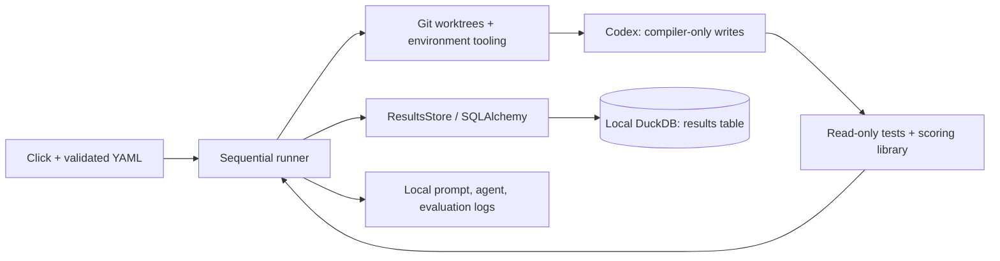

# Compiler autoresearch

Sequential compiler search: change the best verified commit; keep verified improvements.

## System and concurrency

### Computational model

One host: runner, Codex CLI/SDK, worktrees, evaluation, DuckDB, logs; remote model inference.
Sequential attempts; no parallel agent pool, distributed scheduler, or remote DB service.



### Entities

- **Runner/run — [runner.py](runner.py):** one process/invocation; owns `run_id`, frozen config, mutable best commit/score; coordinates work.
- **Agent — `codex exec`:** fresh process per attempt; consumes worktree/prompt, edits `compiler.py`; conversation state is discarded.
- **Git/worktrees — [environment.py](environment.py):** host helpers create/remove temporary
  `<system-temp>/luminal-autoresearch-*/work` checkouts per baseline/attempt. Branches
  `autoresearch/<run>/<iteration>` and proposal commits persist in shared repository metadata.
- **Database — [schema/interface](database.py):** persistent `.autoresearch/results.duckdb`;
  one row per baseline/attempt across runs, accessed through SQLAlchemy/duckdb-engine.
- **Config/prompts — [config.py](config.py), [defaults.yaml](defaults.yaml), [instructions](agent_instructions.md),
  [template](agent_prompt.md):** packaged sources; config hydrates once, prompts render per attempt.
- **Verification — [environment.py](environment.py), [score.py](../score.py):** host scope checks
  plus fresh read-only test/scoring subprocesses return metrics from worktree inputs.
- **Logs — `<db-parent>/logs/<run>/<iteration>/`:** persistent prompt/diagnostic files;
  DB rows store the directory path, not contents. [Files](#what-each-agent-sees).
- **Quota client — [usage.py](usage.py):** fresh per check; authentication/quotas are account state shared across runs.

### Invariants

- **Identity:** one invocation creates one `run_id`; `(run_id, iteration)` identifies
  a result. Iteration 0 is the baseline and starts no agent.
- **Concurrency:** at most one agent attempt is scheduled. One writer per DB is an
  operating requirement; separate invocations are not coordinated by a runner lock.
- **Ownership:** the agent may edit only `compiler.py`; the runner verifies one
  compiler-only proposal commit per changed attempt and owns Git/DB/log writes.
- **Selection:** only a strictly better score after successful evaluation, scope
  validation, and cleanup changes the best parent. Ties and failures retain it.
- **Persistence:** `running` and final results commit separately; no DB transaction
  spans an experiment. No merges/pushes.

SQLAlchemy preserves [DuckDB's concurrency rules](https://duckdb.org/docs/current/connect/concurrency);
[`create_all()`](https://docs.sqlalchemy.org/en/20/core/metadata.html#creating-and-dropping-database-tables)
creates missing tables, not schema migrations.

## Autoresearch algorithm

[runner.py](runner.py) implements greedy search.

| Decision | Behavior |
| --- | --- |
| Run/budget | Evaluate resolved `base` (default `main`), then allow `iterations` attempts (default 10). Failures/no-change consume attempts. |
| Model/effort | Fixed `model`/`effort` (defaults `gpt-6-astra`/`xhigh`); recorded in results/commit footers. No adaptive selection. |
| Proposal | Agent chooses changes using the best compiler/score, packaged instructions, and this run's latest five result summaries. |
| Objective | Require public correctness; maximize `sqrt(cycle_speedup * scratch_reduction)` from per-program geometric means. Full-precision comparison; reject ties/worse scores. |
| Stop/continue | Low quota stops; baseline/quota-read errors abort. Agent/evaluation failures/timeouts are recorded, then continue; Ctrl-C records interruption and exits. |

Evaluation calls the runner's `score.score()` in the read-only sandbox against
the worktree's compiler, machine, and programs; older commits need not contain the API.
Metrics return via JSON, never log parsing; `python score.py` retains its report.

### Loop (pseudocode)

```text
config = hydrate(defaults < YAML < CLI)
run_id = new_id(); best = baseline(resolve(config.base))  # evaluate, clean up, record iteration 0; abort on failure
for iteration in 1..config.iterations:
    if quota_below_reserve(): break    # read errors abort; no attempt row/branch yet
    record_running(run_id, iteration, parent=best.commit)
    status, commit, metrics, error = failed, none, empty, none
    try:
        with fresh_worktree(best.commit):
            agent(config.model, config.effort, best, last_5_results(run_id))
            if validate_proposal() == unchanged:
                status = no_change; continue
            commit = commit_compiler()  # retained even if evaluation fails
            validate_proposal_commit(best.commit, commit)  # one parent, compiler-only diff, clean checkout
            metrics = correctness_tests_then_score()
            validate_worktree_unchanged()
        if metrics.combined_score > best.score:
            best, status = (commit, metrics.combined_score), improved
        else: status = rejected
    except interruption: status, error = interrupted, interruption; abort
    except failure: status = timeout if timed_out else failed; error = failure
    finally: record_final(status, commit, metrics, elapsed_time, error)
report(best)
```

## Run and configure

Requires Python 3.10+, Git, authenticated Codex CLI on macOS/Linux; permission flags checked against Codex 0.157.0.

```sh
make install  # creates .venv; installs package + development tools
codex login
.venv/bin/python -m autoresearch --show-config
.venv/bin/python -m autoresearch --config experiment.yaml --iterations 3
.venv/bin/python -m autoresearch --iterations 0  # baseline only; still uses Codex sandbox
```

Precedence: [defaults.yaml](defaults.yaml) < partial user YAML < explicit CLI options.
Invalid fields fail before execution. `--show-config` prints hydrated
YAML without opening Git, DB, or Codex. `db` is repository-relative; `--config`
is caller-relative. Timeouts default to 900 seconds per agent command and 180 per
evaluation command, not a run deadline. The installed `autoresearch` command aliases `python -m autoresearch`.

### Usage limits

Before each agent attempt, [usage.py](usage.py) uses the
[Python SDK](https://learn.chatgpt.com/docs/codex-sdk#python-library) to call
[`account/rateLimits/read`](https://learn.chatgpt.com/docs/app-server#6-rate-limits-chatgpt).
It reuses `codex` on PATH and saved authentication without a model turn; baseline-only runs skip it.
Minimum percentages remaining (defaults):

```yaml
min_weekly_limit_remaining_allowed: 25
min_5h_limit_remaining_allowed: 5
min_monthly_limit_remaining_allowed: 25
```

Override via YAML/CLI: 0–100, equality allowed, zero still stops at exhaustion.
All reported buckets are checked; durations identify [weekly/five-hour windows](https://learn.chatgpt.com/docs/pricing#what-are-the-usage-limits-for-my-plan);
`individualLimit` is the optional workspace [monthly credit limit](https://github.com/openai/codex/blob/rust-v0.157.0/codex-rs/tui/src/status/rate_limits.rs).
Purchased balances have no percentage denominator and are not treated as quotas.

Low/exhausted or server-blocked quota stops before creating the next branch/logs/row
and reports the best result. Reads time out after 15 seconds; authentication failures,
missing/malformed quotas or unknown window durations abort. API-key-only accounts without ChatGPT quotas cannot use this guard.
Reset timestamps never imply renewed allowance. `read_usage()` and `usage_stop_reason(usage, config)` are reusable independently.

## What each agent sees

```text
trusted host runner                     temporary worktree at best commit
├── user's checkout                     ├── compiler.py                 READ + WRITE
├── shared Git refs/objects              ├── machine.py, score.py        READ
├── results.duckdb                       ├── programs/, tests/, README  READ
└── logs/<run>/<iteration>/              ├── other tracked files         READ
    ├── prompt.txt, codex.log            └── .git → shared metadata      READ
    └── tests.log, score.log
```

The baseline is detached; proposals use fresh branches. Cleanup covers partial creation, completion, errors, and Ctrl-C.
Rules come from the runner package even for older bases. [Worktrees share Git metadata](https://git-scm.com/docs/git-worktree).

- **Tools/writes:** local shell/file editing and installed commands (Python, Git).
  The profile extends `:read-only`, granting only that worktree's `compiler.py`
  writes; use Python `-B`. No runner DB tool or Python Codex SDK is exposed to the agent.
- **Network/external tools:** command networking and approval escalation are disabled,
  as are web search, subagents, apps/plugins, browser, computer use, and image generation.
  System/project MCP controls are separate and must be trusted or restricted by managed policy.
- **Trust:** the host runner trusts the starting repository and installed tools;
  scope checks do not prove code harmless or scores honest.
- **Acceptance:** check HEAD/branch, staged/unstaged changes outside `compiler.py`, extra
  files (including ignored files), and missing/symlinked compilers. Evaluate read-only,
  then check again. No-change/pre-commit failures have no proposal commit.

Invocation uses `--ignore-user-config`, `--ignore-rules`, `--strict-config`, and
`--no-daemon`; managed restrictions still apply. System/project legacy sandbox settings
can override profiles. Every command exit kills remaining process-group children; this is not VM isolation.
[Permissions](https://learn.chatgpt.com/docs/permissions),
[CLI flags](https://learn.chatgpt.com/docs/developer-commands),
[non-interactive execution](https://learn.chatgpt.com/docs/non-interactive-mode).

## Tests

```sh
make test          # infrastructure + original compiler tests; no model calls
make test-sandbox  # opt-in real OS sandbox probes; no model calls
make format       # Ruff format + fixes, line length 150
make check        # formatting/lint checks without edits
```

[Coverage and mocked/untested boundaries](../tests/autoresearch/README.md).
Evaluation uses `tests.test_machine`, `tests.test_public_programs`, and the scoring
library; infrastructure tests never affect scores. Ruff/Black exclude
the original compiler, evaluator, and public tests; Cursor formatting/rulers use 150.

## Gotchas

- **Inputs are committed:** `base` selects a Git commit; uncommitted compiler edits
  are ignored. Default `main` need not be your checked-out branch.
- **Starting from a branch is not resuming:** `--base autoresearch/<run>/<iteration>` creates a new baseline/run, budget, and history.
- **Displays round scores:** equal-looking scores can still improve at full precision.
- **Quota reserves are not spending caps:** checks occur between attempts; an attempt can consume the reserve.
- **Read-only does not hide secrets:** broad local reads remain subject to OS/managed restrictions.
  Model/authentication traffic is outside command-network restrictions.
- **Runner Git hooks are disabled:** per-command override; manual Git keeps its hooks. Proposal commits are checked before evaluation.
- **Crashes can leave `running` rows/stale worktrees:** no automatic recovery/job claiming.
